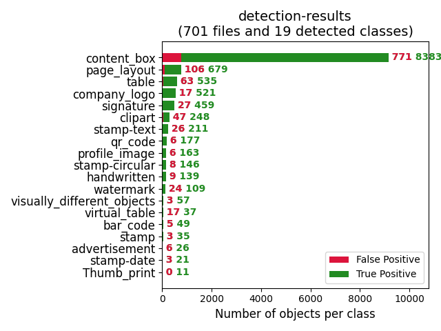
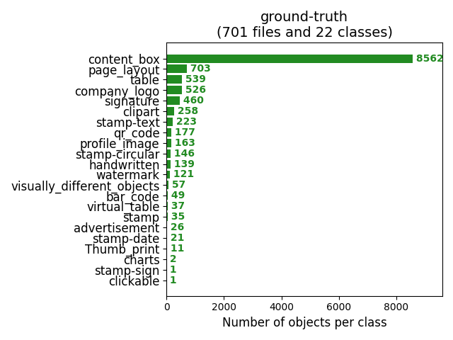
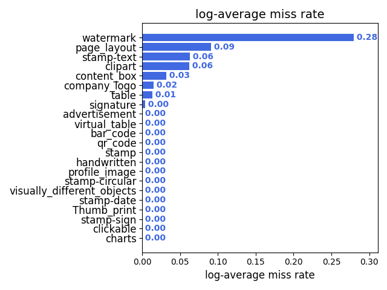
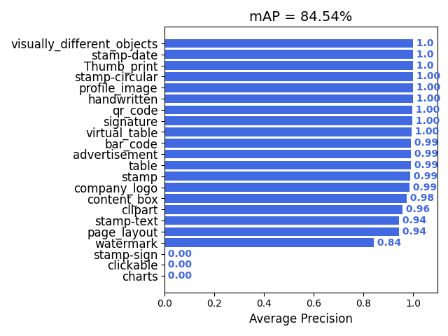

# Yubi's Fintech Document Segmentation Models
We want to segment or find segments in given document image so that we can understand and process document better.

## About
* We used tagged ~700 images in v1 and ~6k images in v1_aug version with augmentations
* In v2 we used >12k images with augmentation.
* Random Augmentations used are - `bright`, `daylight`, `detailenhance1`, `detailenhance2`, `sepia`, `summer`, `winter`, `invert`
* Used Faster-RCNNversion using simple library `detecto`
* Classes used are - `'page layout', 'content box', 'table', 'handwritten', 'company logo', 'watermark', 'signature', 'stamp', 'stamp-text', 'stamp-circular', 'stamp-date', 'stamp-sign', 'profile image', 'bar code', 'qr code', 'clickable', 'Thumb print', 'clipart', 'visually different objects', 'virtual table', 'charts', 'advertisement'`
* `prob_threshold` of `0.3` seems to be better from initial observations.
* Three versions of models are available for now
    * `yubi_document_segmentation_v1` : Trained with ~700 images, 50 epochs, 0.001 learning rate
    * `yubi_document_segmentation_with_aug_v1` : Trained with ~6000 images, 50 epochs, 0.001 learning rate
    * `yubi_document_segmentation_v2` : Trained with ~1600 images (12k augmentations), 25 epochs, 0.002 learning rate,
* Runs on gpu and cpu both. On cpu speed is ~0.5-0.7 seconds depending on image size.
* There is no need of image preprocessing or resizing. Works with all kinds of image color, sizes, noises.
* Data labels are skewed. TextContent label is occuring >8k times and some are even <10 times. For them mAPE did not improve. Need more tag for such classes to improve further.
* Results for `yubi_document_segmentation_v2` model with `0.3` threshold on holdout ~700 images.
    <p align="left"></p>
    <p align="left"></p>
    <p align="left"></p>
    <p align="left"></p>

## How to run

```python

from yubiai.vision.document_segmentation.segment_doc import YubiDocumentSegmentDetection
model = YubiDocumentSegmentDetection(segment_model="yubi_document_segmentation_v1")

imgpath = 'input_image_path'
model.detect_segments(imgpath, prob_threshold=0.3, export_image_with_tags=True, export_image_path="/some/output/folder/tmp.jpg")

#### Output Sample ####
# {'seg1': {'label_id': '0',
#   'label_name': 'page layout',
#   'box': [22.94194221496582,
#    29.284299850463867,
#    1690.063232421875,
#    2325.850830078125],
#   'probability': 0.9987373948097229},
#  'seg2': {'label_id': '9',
#   'label_name': 'stamp-circular',
#   'box': [492.64739990234375,
#    830.1820068359375,
#    908.0197143554688,
#    1249.171142578125],
#   'probability': 0.9969298243522644}, 
# .....
# .....
# }

```